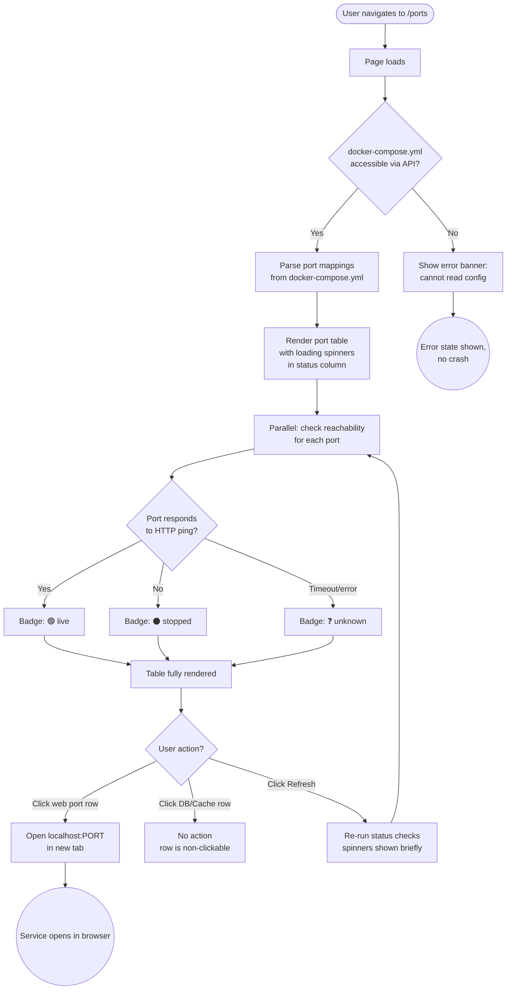
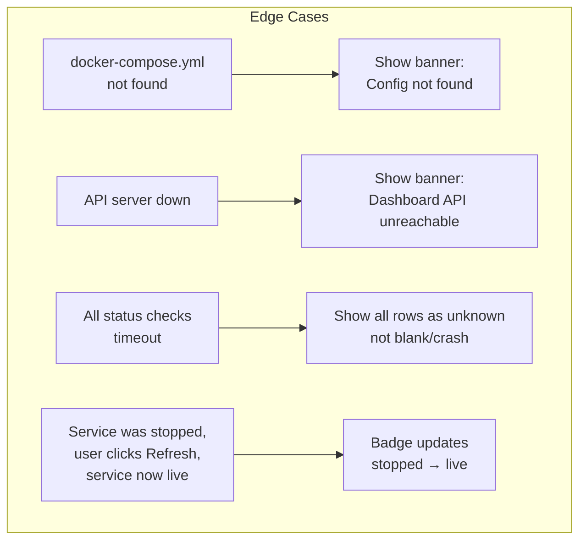

# User Flow: Port Map Page

**Feature:** `port-map`
**Route:** `/ports` in `dashboard-next`
**Source:** `docs/requirements/port-map.md`

---

## Happy Path

---

## Error & Edge Branches

---

## Screen Inventory

| # | Screen / State | Purpose | Key Elements |
|---|---|---|---|
| 1 | Port Map — loading | Page skeleton while fetching | Table rows with spinner in status column |
| 2 | Port Map — populated | Main view | Port col, Service col, Container col, Status badge, Link icon |
| 3 | Port Map — error (config missing) | Config not accessible | Error banner at top, empty table body |
| 4 | Port Map — error (API down) | Dashboard API unreachable | Full-page error state |
| 5 | Status badge: live | Service reachable | Green dot + "live" text |
| 6 | Status badge: stopped | Port not responding | Grey dot + "stopped" text |
| 7 | Status badge: unknown | Check failed/timed out | Yellow dot + "unknown" text |
| 8 | Row — web service | Clickable, opens localhost:PORT | Entire row or ExternalLink icon is clickable |
| 9 | Row — DB/Cache service | Non-clickable | Link icon absent or visually disabled |
| 10 | Refresh button — active | Re-check all statuses | Spinner animation while checking |

---

## Notes

- **Status check mechanism**: the dashboard-api backend pings each port (avoids CORS issues from the browser)
- **Grouping**: rows grouped by service (news-stock: 3 ports together) with visual separator
- **Port type inference**: ports ≤ 5999 that are 5432/6379 → no-link; ports 3000–3999 → frontend; 8000–8999 → API/backend
