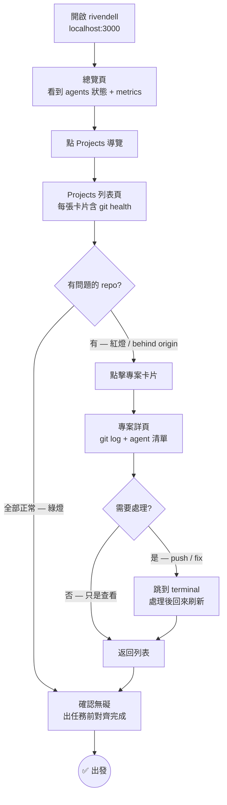
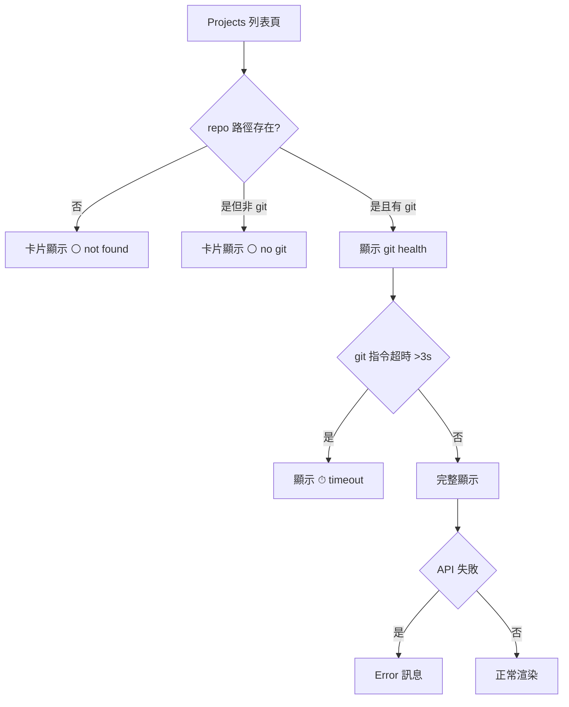

# User Flow: Projects HQ

**Feature:** Git-native repo health on Projects page
**Date:** 2026-04-02

## Happy Path

## Error & Edge Branches

## Screen Inventory

| # | 畫面 | 目的 | 關鍵元素 |
|---|------|------|---------|
| 1 | Projects 列表 | 全局 repo 健康 | 卡片 grid、git badge、agent 計數 |
| 2 | GitStatusBadge | repo 現況 | branch、ahead/behind、last commit、recent files |
| 3 | 專案詳頁 | 深入查看 | agent 清單、recent commits（10 條） |

## GitStatusBadge 顏色邏輯

| 狀態 | 顏色 | 觸發條件 |
|------|------|---------|
| ✓ synced | 綠色 | ahead=0, behind=0 |
| ↑N unpushed | 琥珀色 | ahead > 0 |
| ↓N behind | 紅色 | behind > 0 |
| ⏱ timeout | 灰色 | git >3s |
| ⚪ no git | 灰色 | 路徑不存在 or 非 git repo |
