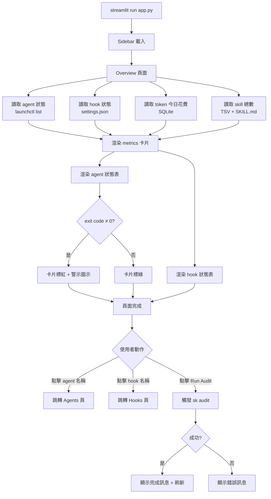
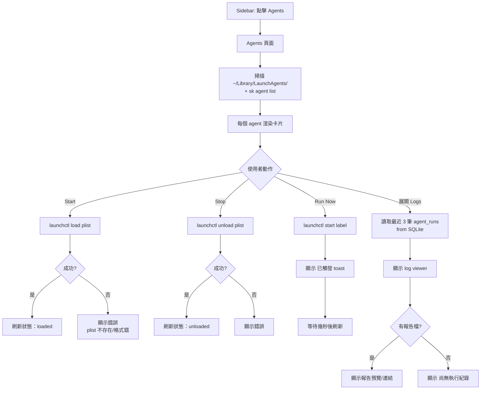
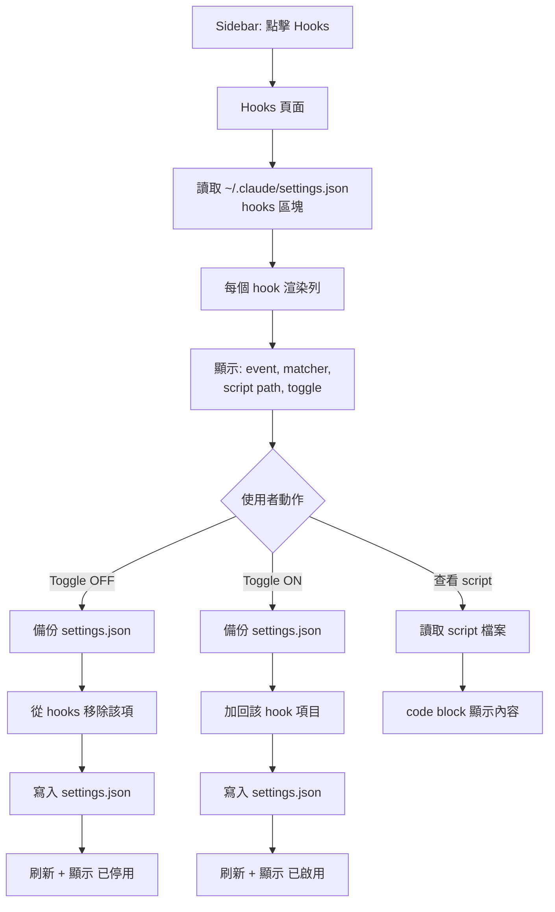
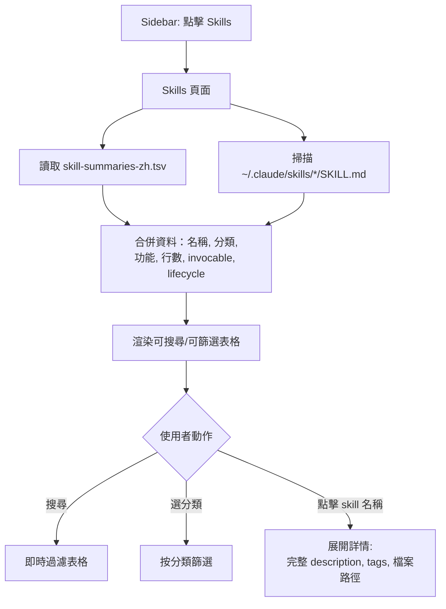
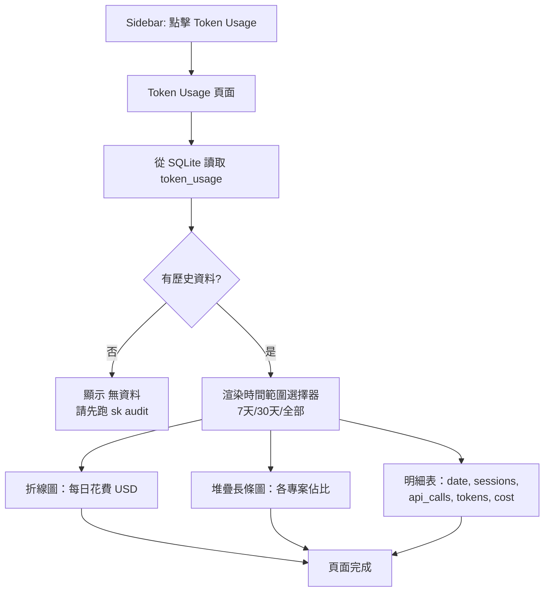
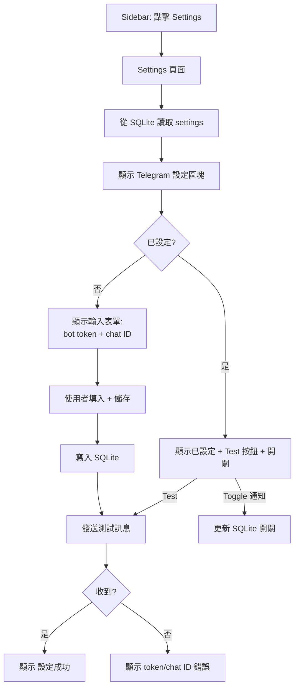

# User Flow: sk-dashboard

## Flow 1: Overview（US-1）

## Flow 2: Agent 管理（US-2, US-3）

## Flow 3: Hook 管理（US-4）

## Flow 4: Skill 總覽（US-5）

## Flow 5: Token 趨勢（US-6）

## Flow 6: Settings（US-8）

---

## Screen Inventory

| # | Screen | Route | Purpose | Key Elements |
|---|--------|-------|---------|-------------|
| 1 | Overview | `Overview` (default) | 全局狀態一覽 | metrics 卡片 x4, agent 狀態表, hook 狀態表, Run Audit 按鈕 |
| 2 | Agents | `Agents` | Agent 管理 + log | agent 卡片（Start/Stop/Run Now）, log viewer, 報告預覽 |
| 3 | Hooks | `Hooks` | Hook 開關管理 | hook 列表 + toggle, script 預覽 |
| 4 | Skills | `Skills` | Skill 瀏覽 | 可搜尋/篩選表格, 分類 filter, 詳情展開 |
| 5 | Token Usage | `Token Usage` | 花費趨勢分析 | 折線圖, 堆疊長條圖, 明細表, 時間範圍選擇 |
| 6 | Settings | `Settings` | 通知設定 | Telegram bot token/chat ID 輸入, test 按鈕, 通知開關 |

### Reusable Components

| Component | Used In |
|-----------|---------|
| Sidebar（頁面導覽 + Run Audit） | 全部頁面 |
| Status Badge（loaded/unloaded/error） | Overview, Agents |
| Metric Card（數字 + 標籤 + 顏色） | Overview, Token Usage |
| Expandable Log Viewer | Agents |
| Searchable DataTable | Skills, Token Usage |
