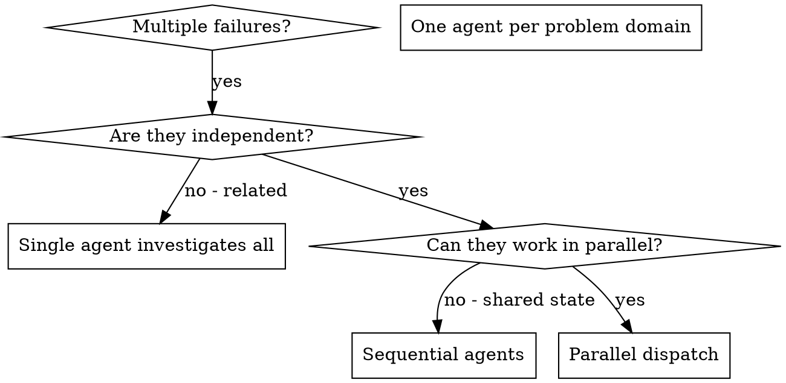

# Dispatching Parallel Agents

## Overview

When you have multiple unrelated failures (different test files, different subsystems,
different bugs), investigating them sequentially wastes time. Each investigation is
independent and can happen in parallel — each in its own **git worktree** so workers
never edit the same checkout.

**Core principle:** Dispatch one agent per independent problem domain. Isolate each in
a worktree. Review diffs before integrating. Reconcile changelogs at the end.

## Non-Negotiables

- Keep every worker in its own branch and git worktree. Never let parallel workers
  edit the same checkout.
- Do not start workers until you understand enough code, tests, docs, and constraints
  to write bounded task prompts with clear ownership.
- Do not trust worker summaries. Review diffs, run tests, and inspect actual files
  before integrating anything.
- Protect user work. Check for uncommitted changes up front and do not overwrite,
  stash, reset, or delete anything you did not intentionally create.
- Integrate only reviewed work. Reject or send follow-up prompts for incomplete,
  speculative, conflicting, or unverified output.
- Every parallel worker must update the repo-standard changelog or produce a
  per-worker changelog fragment. The coordinator must reconcile fragments into the
  canonical changelog before final merge.
- Final integration must merge accepted work back into the branch that was checked
  out at preflight. If that cannot be done, leave a clear report explaining why,
  where the work lives, what is still missing, and the exact next commands.

## When to Use



**Use when:**
- 3+ test files failing with different root causes
- Multiple subsystems broken independently
- Each problem can be understood without context from others
- No shared state between investigations

**Don't use when:**
- Failures are related (fix one might fix others)
- Need to understand full system state
- Agents would interfere with each other (editing same files, using same resources)
- Exploratory debugging where you don't know what's broken yet

## The Pattern

### Phase 0: Preflight

Before spawning any workers, verify the environment and protect user state.

```sh
git status --short --branch
git rev-parse --show-toplevel
git branch --show-current
command -v tmux
```

Set shared names:

```sh
PROJECT_DIR="$(git rev-parse --show-toplevel)"
INTEGRATION_BRANCH="$(git branch --show-current)"
test -n "$INTEGRATION_BRANCH"
BASE_REF="$INTEGRATION_BRANCH"
WORKTREE_ROOT="${PROJECT_DIR}.worktrees"
```

If the main worktree has uncommitted changes, classify them:

- **Unrelated user changes** — leave them alone and branch workers from `HEAD`.
- **Workers need those changes** — include the relevant diff in each prompt or ask
  the user how they want the changes made visible to worktrees.
- **Not a git repository** — stop and use a non-worktree approach (original pattern).

Find the changelog convention before spawning workers:

```sh
find "$PROJECT_DIR" -maxdepth 3 \
  \( -iname 'CHANGELOG*' -o -iname '*release*notes*' -o -path '*/changes/*' \) \
  -print
```

If the repo has a single shared changelog that would create conflicts, require each
worker to write a unique fragment (e.g. `.worker-runs/changelog/<task>.md`) and
merge those fragments during integration.

### Phase 1: Identify Independent Domains

Read enough of the repo to make a real implementation plan. Cover architecture,
entrypoints, tests, docs, build steps, and likely conflict points.

Group failures by what's broken:
- File A tests: Tool approval flow
- File B tests: Batch completion behavior
- File C tests: Abort functionality

Each domain is independent — fixing tool approval doesn't affect abort tests.

### Phase 2: Create Focused Agent Tasks

For each proposed worker task, write:

```text
Task:
Branch/worktree name:
Owned files or modules:
May read:
Must not edit:
Goal:
Acceptance criteria:
Verification commands:
Changelog path or fragment:
Integration risk:
Dependencies:
```

Choose parallel tasks only when their write scopes are disjoint enough to review and
merge independently. Keep tightly coupled design work, shared API changes, migrations,
or cross-cutting refactors serial.

Good agent prompts are:
1. **Focused** — One clear problem domain
2. **Self-contained** — All context needed to understand the problem
3. **Specific about output** — What should the agent return?

Worker prompt template:

```markdown
You are a parallel agent worker running in an isolated git worktree.

Task:
<one bounded task>

Ownership:
- You may edit: <owned files/modules>
- You may read: <supporting files/modules>
- You must not edit: <other worker scopes and unrelated files>

Context:
<relevant plan, constraints, API contracts, links to tests>

Requirements:
- First inspect the relevant code and tests.
- Keep changes scoped to your ownership.
- You are not alone in the codebase. Other workers are editing disjoint scopes.
  Do not revert or rewrite work outside your task.
- Add or update focused tests when behavior changes.
- Update the repo-standard changelog/release notes for your task. If the changelog is
  a shared conflict point, write a unique fragment at `.worker-runs/changelog/<task>.md`
  then report the path.
- Commit your finished work on this branch with a Conventional Commit message.

Final response:
- Commit SHA
- Changed files
- Changelog file or fragment path
- Verification commands and results
- Known gaps or risks
```

### Phase 3: Spawn Workers in Worktrees

Each worker gets its own git worktree and tmux session:

```sh
NAME="<task-name>"
BRANCH="$NAME"
WORKTREE="$WORKTREE_ROOT/$NAME"
SESSION="agent-worker-$NAME"

# Create worktree with its own branch
git worktree add "$WORKTREE" -b "$BRANCH" "$BASE_REF"

# Start agent in tmux session
tmux new-session -d -s "$SESSION" -x 200 -y 50 \
  "cd '$WORKTREE' && claude --dangerously-skip-permissions"
```

For Claude Code specifically:

```typescript
// Using Task() in Claude Code
Task("Fix agent-tool-abort.test.ts failures")
Task("Fix batch-completion-behavior.test.ts failures")
Task("Fix tool-approval-race-conditions.test.ts failures")
// All three run concurrently, each in its own worktree
```

### Phase 4: Monitor and Steer

Check workers regularly:

```sh
# Check tmux sessions
tmux list-sessions

# Capture recent output from a worker
tmux capture-pane -t "agent-worker-$NAME" -p | tail -120

# Check worktree status
git -C "$WORKTREE_ROOT/$NAME" status --short
git -C "$WORKTREE_ROOT/$NAME" log --oneline "$BASE_REF"..HEAD
```

Send follow-up instructions instead of abandoning a worker at the first issue.
Use follow-ups for failed tests, overbroad edits, missed requirements, or conflicts
with another worker. Keep follow-ups bounded.

### Phase 5: Review Worker Output

For each worker, inspect the worktree from the main coordination session:

```sh
WT="$WORKTREE_ROOT/<name>"
BRANCH="<name>"

git -C "$WT" status --short
git -C "$WT" log --oneline "$BASE_REF"..HEAD
git -C "$WT" diff --stat "$BASE_REF"...HEAD
git -C "$WT" diff "$BASE_REF"...HEAD
```

Run the worker's verification commands yourself in that worktree. Add targeted tests
or broader checks when the blast radius is larger than the worker assumed.

Decision rules:

- **Accept** when the diff is scoped, correct, tested, and compatible with the
  integration plan.
- **Accept only** when the worker included a changelog update or fragment (unless the
  repo truly has no changelog convention; record that exception explicitly).
- **Send back** for fixes when the approach is sound but incomplete or tests fail.
- **Reject** when the worker changed the wrong scope, invented APIs, ignored
  constraints, produced excessive churn, or overlaps a better accepted branch.
- Keep notes on every accepted, rejected, and pending branch with the reason.

### Phase 6: Integrate

Return to the main worktree and confirm it is clean:

```sh
git status --short --branch
test "$(git branch --show-current)" = "$INTEGRATION_BRANCH"
```

Integrate accepted work:

```sh
# Merge a whole reviewed branch
git merge --no-ff <worker-branch>

# Or cherry-pick selected commits
git cherry-pick <commit-sha>
```

Resolve conflicts in the integration worktree, not inside worker checkouts. After
each substantial merge, run focused tests. After the full batch, run repo-level checks:

```sh
make format   # or equivalent
make check
make test
```

**Changelog reconciliation:** Before the final merge is considered done, reconcile
every accepted worker changelog entry into the canonical changelog/release notes.

Verify the integrated result is on the original checked-out branch:

```sh
git branch --show-current   # must equal $INTEGRATION_BRANCH
git status --short
git log --oneline "$BASE_REF"..HEAD
```

If final merge-back is impossible, do not imply completion. Leave a clear report with:
- Original checked-out branch from preflight
- Current branch and all worker/integration branches containing accepted work
- Exact blocker (conflicts, failed tests, dirty user changes, missing changelog)
- Completed work, missing work, and validation already run
- Exact next commands for the user or next agent to resume safely

### Phase 7: Cleanup

After accepted work is integrated and rejected work has been recorded:

```sh
# Kill tmux sessions
tmux kill-session -t "agent-worker-$NAME"

# Remove worktrees
git worktree remove "$WORKTREE_ROOT/$NAME"

# Delete merged branches
git branch -d "$NAME"

# Prune stale worktree metadata
git worktree prune
```

Use `git branch -d` (lowercase) for branches already merged. Use `git branch -D`
(uppercase) only when the branch is intentionally discarded and its useful details
have been recorded.

## Deterministic Runner Loops

Use deterministic Bash or Python loops when task fan-out is driven by conditions,
inventory, backup status, or other logic that should be auditable and repeatable.
This is the safer path for:

- Self-hosted upgrades
- Docker/LXC/VM changes
- Database migrations
- Fleet-wide config edits
- Package bumps across services
- Any task where a failed preflight must prevent every worker from starting

### JSON Plan Format

Create a plan JSON with this structure:

```json
{
  "run_name": "upgrade-services",
  "repo": ".",
  "base": "main",
  "max_parallel": 3,
  "agent": {
    "cli": "claude",
    "args": ["--dangerously-skip-permissions", "--print"],
    "prompt_mode": "stdin",
    "timeout_seconds": 3600
  },
  "preflight": [
    { "name": "check-clean", "command": "git status --short | wc -l | grep -q '^0$'" }
  ],
  "backups": [
    { "name": "db-backup", "command": "pg_dump ...", "condition": "test -f /var/run/postgresql/.s.PGSQL.5432" }
  ],
  "tasks": [
    {
      "name": "upgrade-api",
      "branch": "upgrade-api",
      "prompt": "Upgrade the API service dependencies...",
      "verify": ["cd api && make test"]
    },
    {
      "name": "upgrade-web",
      "branch": "upgrade-web",
      "prompt": "Upgrade the web frontend dependencies...",
      "verify": ["cd web && npm test"]
    }
  ],
  "postflight": [
    { "name": "integration-test", "command": "make integration-test" }
  ],
  "rollback": [
    { "name": "restore-db", "command": "pg_restore ..." }
  ]
}
```

Generated loops will:
- Run preflight commands first (fail-fast)
- Run backup commands only when their conditions pass (fail closed on backup failure)
- Create one git branch and worktree per task
- Run the agent CLI non-interactively in each worktree
- Capture prompts, agent output, verification logs, and a manifest under `.worker-runs/`
- Write rollback commands when tasks fail
- Respect `DRY_RUN=1`, `RUN_ID=...`, and `LOG_ROOT=...` environment overrides

## Common Mistakes

**Wrong:** "Fix all the tests" — agent gets lost
**Right:** "Fix agent-tool-abort.test.ts" — focused scope

**Wrong:** "Fix the race condition" — no context
**Right:** Paste the error messages and test names

**Wrong:** No constraints — agent might refactor everything
**Right:** "Do NOT change production code" or "Fix tests only"

**Wrong:** "Fix it" — you don't know what changed
**Right:** "Return summary of root cause and changes"

**Wrong:** Workers sharing a checkout — merge conflicts and race conditions
**Right:** Each worker in its own worktree and branch

**Wrong:** Trusting worker self-reports — workers can hallucinate success
**Right:** Review diffs and run verification commands yourself

## Final Report

After all phases, report:

- What was integrated, with worker branches and commit SHAs
- What was rejected or left out, with reasons
- Verification commands run and their results
- Changelog reconciliation status
- Cleanup performed (removed tmux sessions, worktrees, branches)
- Remaining missing work, risks, or follow-up tasks

## Real Example from Session

**Scenario:** 6 test failures across 3 files after major refactoring

**Failures:**
- agent-tool-abort.test.ts: 3 failures (timing issues)
- batch-completion-behavior.test.ts: 2 failures (tools not executing)
- tool-approval-race-conditions.test.ts: 1 failure (execution count = 0)

**Decision:** Independent domains — abort logic separate from batch completion
separate from race conditions

**Dispatch (each in its own worktree):**
```
Agent 1 → worktree: fix-abort      → Fix agent-tool-abort.test.ts
Agent 2 → worktree: fix-batch      → Fix batch-completion-behavior.test.ts
Agent 3 → worktree: fix-race       → Fix tool-approval-race-conditions.test.ts
```

**Review:** Inspected each worktree diff against BASE_REF, ran verification commands.

**Results:**
- Agent 1: Replaced timeouts with event-based waiting (changelog fragment written)
- Agent 2: Fixed event structure bug — threadId in wrong place (changelog fragment written)
- Agent 3: Added wait for async tool execution to complete (changelog fragment written)

**Integration:** Merged all three branches with `--no-ff`. All fixes independent,
no conflicts, full suite green. Reconciled changelog fragments into CHANGELOG.md.

**Cleanup:** Killed tmux sessions, removed worktrees, pruned branches.

**Time saved:** 3 problems solved in parallel vs sequentially.
