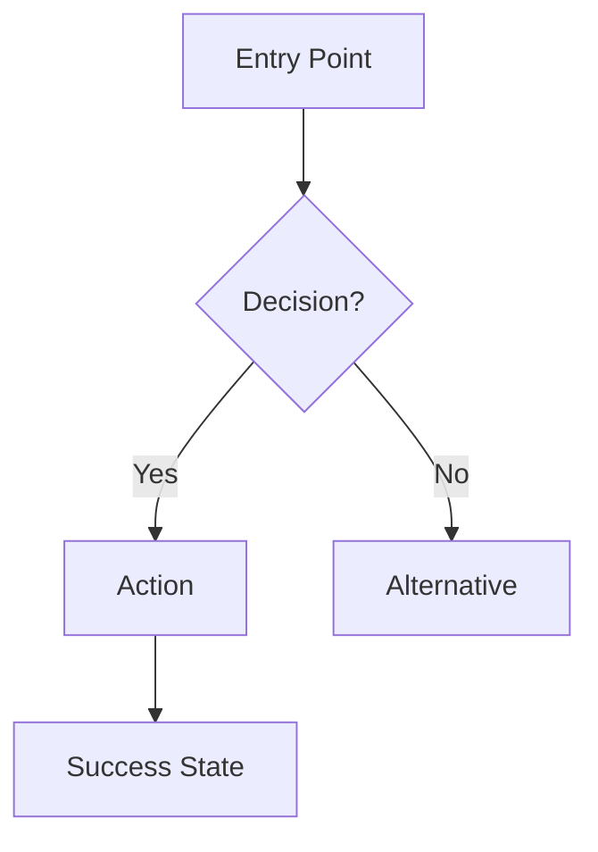
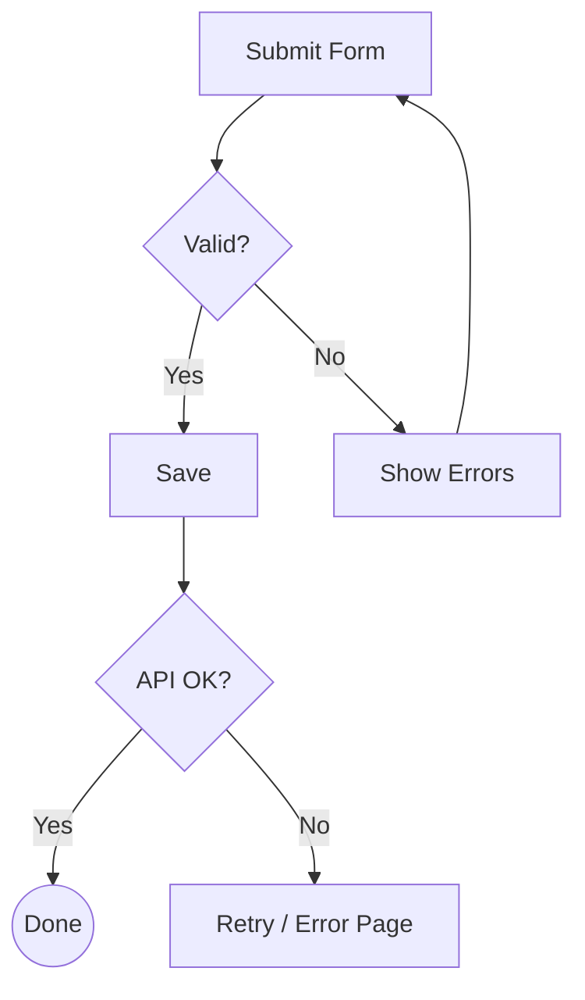

# User Flow Design

Map out the complete user journey as a Mermaid flowchart before wireframing or coding.

**Announce at start:** "I'm using the User Flow skill to map the journey."

## Instructions

### Step 1: Identify Entry Points

Ask the user (skip what's already known):

1. Where does the user **enter** this flow? (URL, button, notification, etc.)
2. What is the **success state**? (order placed, file saved, etc.)
3. Are there **roles** with different paths? (admin vs user, free vs paid)

If a requirement doc exists (`docs/requirements/`), read it first.

### Step 2: Map the Happy Path

Draw the primary flow in Mermaid:

Rules:
- One flowchart per distinct user goal
- Use `{ }` for decisions, `[ ]` for actions, `(( ))` for end states
- Label every edge — no unlabeled arrows

### Step 3: Add Error & Edge Branches

For each decision node, ask:
- What if the user **goes back**?
- What if **validation fails**?
- What if the **network/service is down**?
- What if the user **has no permission**?

Add these as branches with distinct styling:

### Step 4: Screen Inventory

From the flowchart, extract a screen list:

| # | Screen | Purpose | Key Elements |
|---|--------|---------|-------------|
| 1 | Login | Authentication | email, password, submit, forgot link |
| 2 | Dashboard | Overview | stats cards, action buttons |

This becomes the wireframe checklist.

### Step 5: Output

Save to `docs/flows/{feature-name}-flow.md`.

Include both the Mermaid source and the screen inventory table.

### Step 6: Handoff

After saving, prompt:

> **User flow complete.** {N} screens identified.
> Next step: create wireframes — use the `ui-ux-pro-max` skill for layout and component guidance,
> or `frontend-design` to jump straight to high-fidelity mockups.
